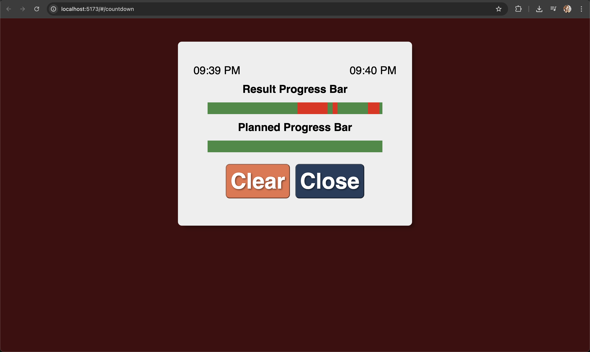

# Focus Timer 專注計時器

專注計時器（Focus Timer）是一款結合番茄鐘與專注追蹤的生產力工具，協助使用者高效管理任務、追蹤專注狀態，並以視覺化方式呈現專注與分心時間，提升自我管理能力。

---

## 📹 Demo 影片 | Demo Video

  
[▶ Watch Demo Gif](demo.gif) 
[▶ Watch Full Demo Video](https://youtu.be/g2npnJD4yfA)

---

## 專案特色

- **專注計時與任務管理**：可自訂任務名稱、工作/休息時長，並支援任務切換與重設。
- **專注狀態自動追蹤**：自動偵測頁面可見性與路由切換，精確記錄專注與分心時段。
- **專注分析視覺化**：以進度條分段顯示專注與分心時長，幫助使用者檢視專注分布。
- **資料持久化**：所有任務與專注紀錄皆儲存於 localStorage，資料不會因刷新而遺失。
- **模組化狀態管理**：採用 Jotai atom 與自訂 hooks，提升程式碼可維護性與擴充性。
- **型別安全與資料驗證**：全程 TypeScript 與 Zod schema 驗證，確保資料結構正確。

---

## 技術棧

- React
- TypeScript
- Jotai
- Zod
- localStorage
- React Router
- SCSS
- Vite

---

## 安裝與啟動

```bash
git clone https://github.com/jiawu777/focusTimer.git
cd focusTimer
npm install
npm run dev
```

## 目錄結構

```bash
src/
  components/         # React 元件
  hooks/              # 自訂 hooks
  store/atoms/        # Jotai atoms
  store/utils/        # 工具與 localStorage 操作
  constants/          # 常數與預設值
  pages/              # 頁面元件
```

## 使用說明

1. 新增任務，設定工作與休息時長。
2. 點擊開始計時，系統自動追蹤專注狀態。
3. 可於分析頁檢視專注與分心時間分布。

## License

MIT
